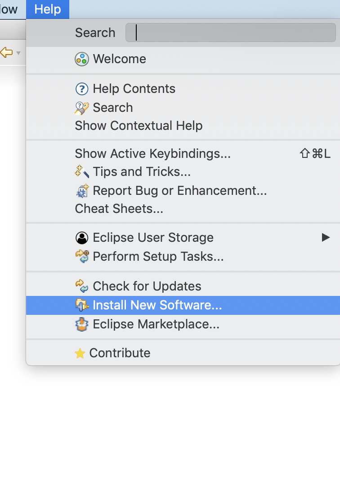
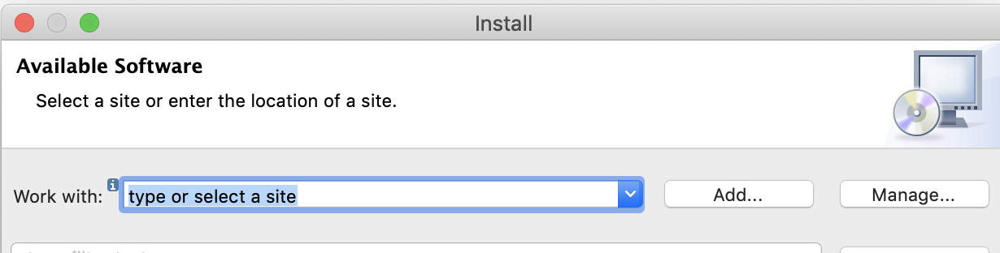
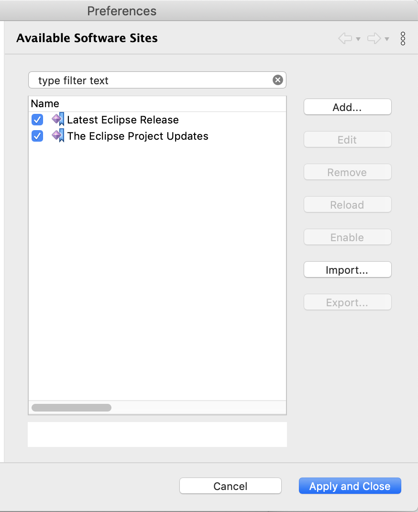
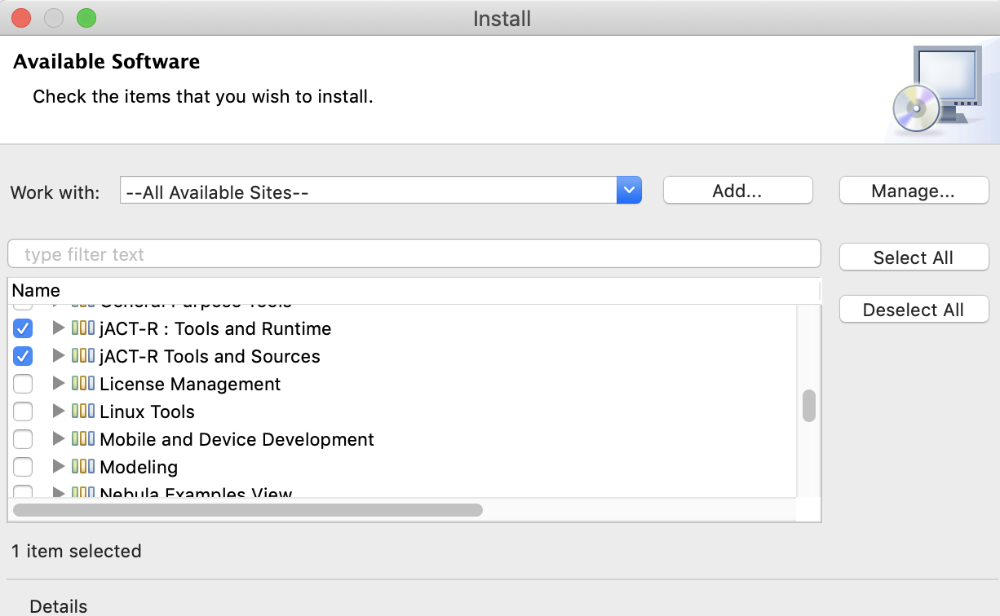

# JASM
The jACT-R Assembler is a high-level language for [jACT-R](http://www.jact-r.org/), the Java implementation of [ACT-R](http://act-r.psy.cmu.edu). It provides an imperative programming model that compiles into productions for execution. 

## Installation
JASM runs within the [Eclipse](http://www.eclipse.org/) IDE. 
1. [Download](https://www.eclipse.org/downloads/) and install the RCP/RAP version. 
2. Open the application.
3. Menu -> **Help** -> **Install New Software** 
   
4. **Manage** 
5. **Import** 
6. Select this [file](updateSites.xml) to import. **Apply and Close**
7. In the **Work with** dropdown menu, select **--All Available Sites--**. *It will take a few minutes to populate the menu with installable software*
8. Select all software under **jACT-R** 
9. Click **Next** to finalize the installation.

## Tutorial

## References

##Distribution statement

Approved for public release: distribution unlimited. Redistributions of source and binary forms, with or without modification, are permitted if redistributions retain the above distribution statement and the following disclaimer.

##Disclaimer

The software is supplied “as is” without warranty of any kind.

As the owner of the software, the United States, the United States Department of Defense, and their employees: (1) disclaim any warranties, express or implied, including but not limited to any implied warranties of merchantability, fitness for a particular purpose, title or non-infringement, (2) do not assume any legal liability or responsibility for the accuracy, completeness, or usefulness of the software, (3) do not represent that use of the software would not infringe privately owned rights, (4) do not warrant that the software will function uninterrupted, that it is error-free or that any errors will be corrected.

Portions of the software resulted from work developed by or for the U.S. Government subject to the following license: the Government is granted for itself and others acting on its behalf a paid-up, nonexclusive, irrevocable worldwide license in this computer software to reproduce, prepare derivative works, to perform or display any portion of that work, and to permit others to do so for government purposes.
