# Unit 1 Tutorial for JASM, Part 1

- [Installation](#installation)
- [15 minute tutorial](#tutorial)
- [Addition model](#addition)
- [Running](#running) addition model

## Installation
1. Follow these [instructions](../../README.md#installation) for base setup.
2. **File** -> **Import...** -> **GIT** -> **Projects from Git (with smart import)**
3. **Clone URI**, enter *https://github.com/amharrison/JASM.git*
4. 

## Tutorial
JASM is a C-style imperative programming language with a pattern matching twist. It has
the expected flow control statements (e.g., *if*, *while-do*, *do-while*) and a few others
(e.g. *repeat-until*, *until-repeat*). Whereas conditional evaluation is usually of boolean
expressions, in JASM they are pattern matching requests. 

### Function calls
Goal management has been subsumed by function calls. Imagine you are writing a subtraction
model. 
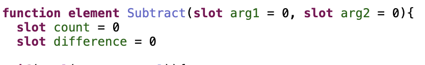

This defines a function that will return some element. The function takes two arguments, *arg1* and
*arg2* with their respective default values. The function also includes two local variables, *count* and 
*difference*. 

This will generate a new ACT-R chunktype describing the function.

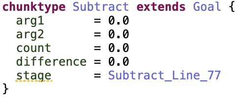 

### Buffer patterns
Imagine the first thing our function does is check to see if *arg2* is zero. If so, we know
the difference is *arg1* and we can return. Here we see the first example of ACT-R's pattern matcher being applied.

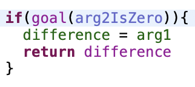

What you see is not a function call returning a boolean, rather a test of the contents of the *goal* buffer against
the named pattern, *arg2IsZero*. *arg2IsZero* is defined before the function.

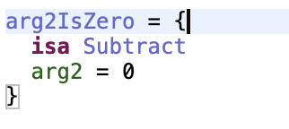

A pattern is a named entity (defined before or after the function) that describes the
potential contents of a buffer. In this case, we are testing to see if the contents are of type (**isa**)
*Subtract*. Note: this is the same name as the function. This will always be the case for goal tests during
the execution of that function.

The pattern tests the value of slot *arg2* against 0. The standard array of boolean operators is available here (i.e., =,!=,<,<=,>,>=).

Next we perform another test, this time to check to see if *arg1* and *arg2* are equal. If so, the difference is 0 
and we can return.

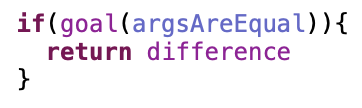

This time the pattern is a bit more complex. 

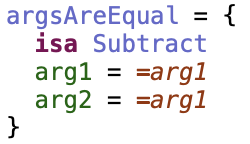

Since we are testing one slot value against another, we need to use a pattern 
variable, *=arg1*. The first time a pattern variable is encountered, its value is set. Subsequent references
against it are tests. So when we test this pattern against a buffer, the value of *arg1* slot is assigned to *=arg1* then 
we test slot *arg2* to see if it is equal to the value of *=arg1*. 

Pattern variables are an important (and odd) feature that is directly inherited from ACT-R. Those
familiar with ACT-R productions should note the similarity to production variables.

### Buffer requests
Now that you know how to test the contents of a buffer, we can turn our attention to
how the buffers get filled. Continuing our subtraction example, we now try to retrieve
a prior instance of this fact. We do this by making a **request** of the *retrieval* buffer.

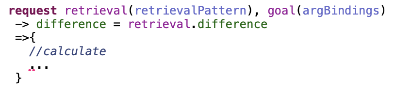

This is read as follows: request something from the *retrieval* buffer that matches the
pattern *retrievalPattern*, using the contents of *goal* to define some variables. On 
success (**->**), set *difference* to the value of the *difference* slot in *retrieval*. On failure (**=>**),
calculate.

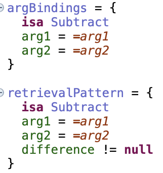

Once again, we need to use pattern variables. We want to retrieve something that matches *retrievalPattern*, but
those variable values are defined by the binding pattern, *argBindings*.

The **request** call can take multiple forms depending on the requirements of the buffer in question. It can support
a strict-harvesting-safe success handler (**->**), or not. If you omit it, you are responsible for removing the buffer
contents explicitly using **remove** *bufferName*. Error handlers (**=>**) are optional, but strongly 
recommended.

# Addition
Now that you have the basics, we'll introduce you to the models in this tutorial. You can find the addition
model in *unit1/src/unit1/additionDefinition.jasm*. We'll now walk through this model line by line.

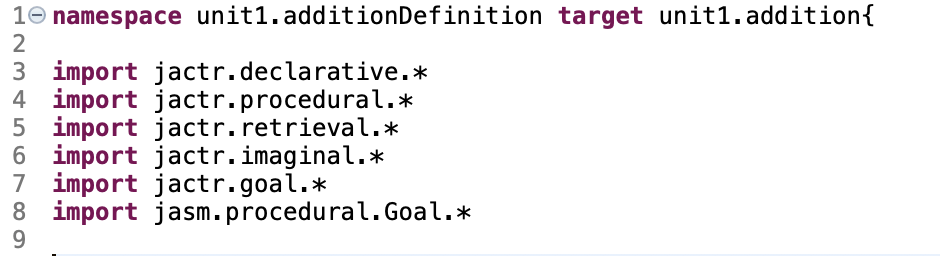

The **namespace** instruction defines the local namespace which can be used to import contents into other models.
It also defines the **target** namespace of the generated code. To prevent collisions, these two should never be the same.

If you look under *unit1/src-gen/unit1/* you'll see the generated file *addition.jactr*. If you change the **target**, you will
change the file that is generated.

Next we have the **import** statements that pull in jACT-R chunks and chunktypes. Go ahead and Ctrl-Click (or Command-Click) one of the imports. This will open the imported resource for reviewing. At all times, you can Ctrl-Click and it will take you to the definition of that element. 

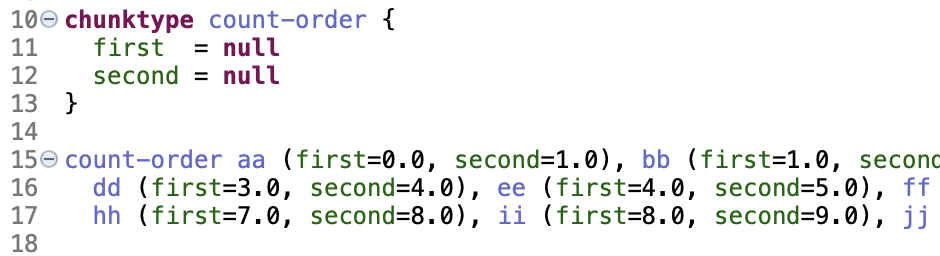

Here we have some embedded jACT-R commands defining a chunktype for *count-order* and a set of chunks that define the count order from 1-10. These are the declarative contents required for the model to run.

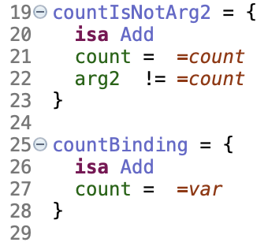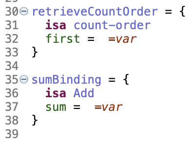

Lines 19-39 define the various patterns we will use. Some are used just once, some more than once. 

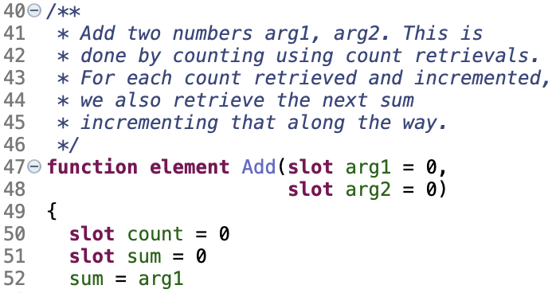

Here we define the **function** *Add*. It returns an **element** (chunk, number, string, boolean). (**void** is also permitted for return type). The function takes two parameters *arg1* and *arg2*. To calculate the sum, we need two local variables, *count* and *sum*. To start, we assign *sum* to *arg1*.

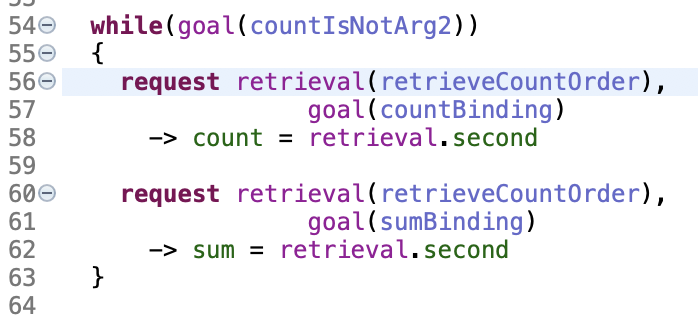

Here we have the body of the function. The while loop will exit once *count* is equal to *arg2*. (Mouse over the pattern name *countIsNotArg2*, the definition of the pattern should show up as a tooltip. Much like navigation, this mouse over behavior is available for most source elements.) First, we make a *retrieval* **request** looking for a count fact. We pull the variable bindings from *countBinding*. If successful, we increment *count* with the retrieved value and **retrieval** is emptied. There is no error handler. Next we repeat the *retrieval* **request** but this time pulling the variable bindings from *sumBinding*. On success, we increment *sum* with the retrieved value and **retrieval** is emptied. 

The lack of error handlers means that if you try to add two values for which you do not have adequate count-facts, the model will eventually halt with nothing to be done.

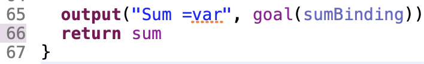

Next, we output the value using the **output** function call. It takes a string and optionally a series
of binding patterns for variable resolution. Any variables referenced in the string will be expanded. Finally we return the value calculated for the sum.

Now that we've walked through the model, let's run it!

##Running
Each JASM file effectively generates a little jACT-R library. The library can't be run by itself; it defines operations on buffers, not their initial states. To run one of the code generated, we need a model to load the library. Open *unit1/models/unit1/addRunner.jactr*. This is a bare-bones jACT-R model that imports the contents of the library (**import unit1.addition.* **), defines the core modules and parameters, then sets the initial buffer states. This is the actual model we will run.

Select menu -> **Run**->**Run Configurations...**
 
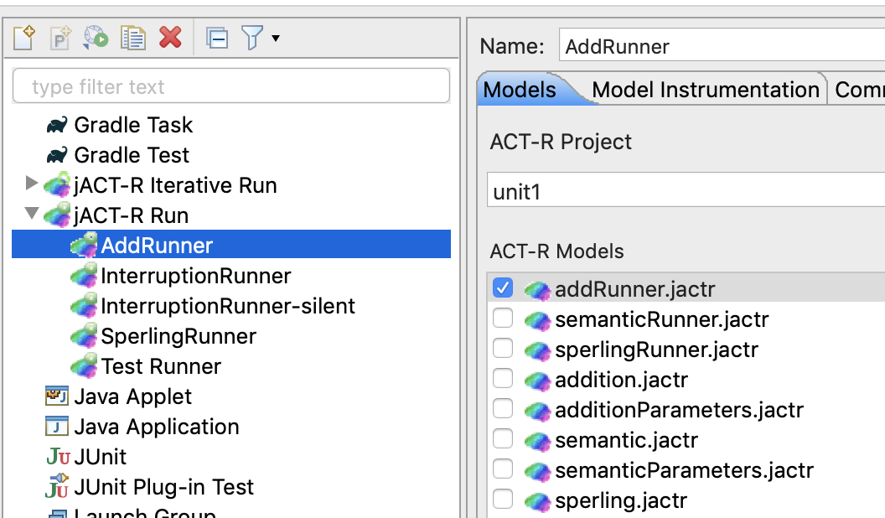

Run configurations containg all the information necessary to run a given model. In this case, we want to select **AddRunner**. Click on **Run**. The IDE will ask if you want to change perspectives, click **Yes**. You are now in the jACT-R Run Perspective, it has views for logging, conflict resolution, buffer contents, and the visicon. (To change perspective, click on the icons in the upper right corner of the window.) 

It will take a moment to start the model the first time you run it. The IDE does aggressive caching to accelerate subsequent runs. If all went well, you should see the result in the log view. Click on any row to see the log messages from that instant in time. The buffer and conflict resolution views are linked to the log view selection.

Now let's go on to the [semantic model](README2.md)