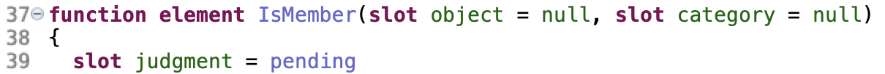
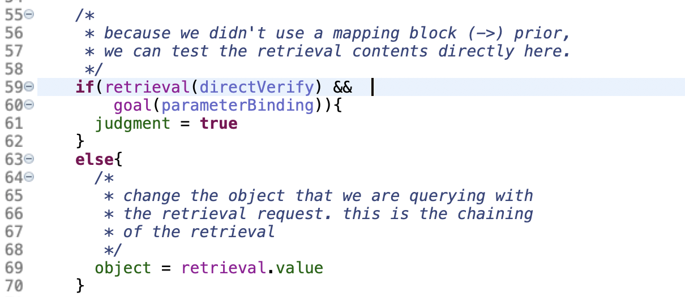
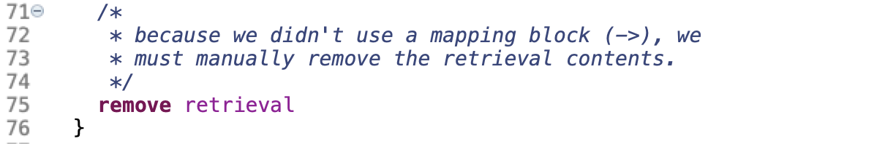
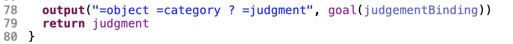

# Unit 1 Tutorial for JASM, Part 2

- [Semantic model](#semantic)
- [Running](#running) semantic model

## Semantic
The semantic model illustrates how to chain retrievals. The JASM version also highlights one of the alternative forms of **request**. Let's open up *unit1/src/unit1/semanticDefinition.jasm*. And skip down to line 37. (If line numbers aren't turned on, open menu->**Preferences**->**General**->**Editors**->**Text Editors**->**Show Line Numbers**)

The generated model is *unit1/src-gen/unit1/semantic.jactr*, and the runner is *unit1/models/unit1/semanticRunner.jactr*.

Here we see the function definition. It takes two parameters and uses one local variable. Default slot values can take any constant value, but not a variable reference or function call.

Here we set up the loop on *judgmentIsPending*. We will set *judgment* to **true** or **false** once we have an answer. The first thing we do at the top of the loop is make a *retrieval* **request** for something fact linking this *object* through *attribute* *category*. If the retrieval fails, we know nothing about *object* and we set *judgment* to **false**.

**Note:** There is no success handler (**->**) block. This means that the contents of *retrieval* will be retained until an explicit **remove** instruction is encountered. During this interval, you can test the contents of the buffer. This is in contrast to when you have a success handler (**->**) block, where the value is mapped and then the buffer is cleared.

Here we see the testing of *retrieval* and *goal* simultaneously. The test of *goal* is just to binding pattern variables for *retrieval*'s test. **Note:** You can only use *and* (**&&**) not *or* or *not*. Basically, if the contents of retrieval match those of *object* and *category*, we match directly and can take its judgment to be **true**. If we don't directly match, we use the results of the retrieval to update our internal representation and chain through another retrieval when the loop resets.

Finally, we perform the manual removal of the contents of *retrieval*. If you fail to remove the contents of retrieval (go ahead an comment out the line), you will notice you now have a compilation error. The compiler will try to keep track of the contents of the buffers as you code and will detect common problems that can occur. 
 

Once a judgment has been rendered, we output it using the binding pattern to get the variable values.

##Running 
Once again, open the run configurations. Select menu -> **Run**->**Run Configurations...**. This time select the **SemanticRunner** configuration and run it. 

Finally, we can turn our attention to the [Sperling model](README3.md)