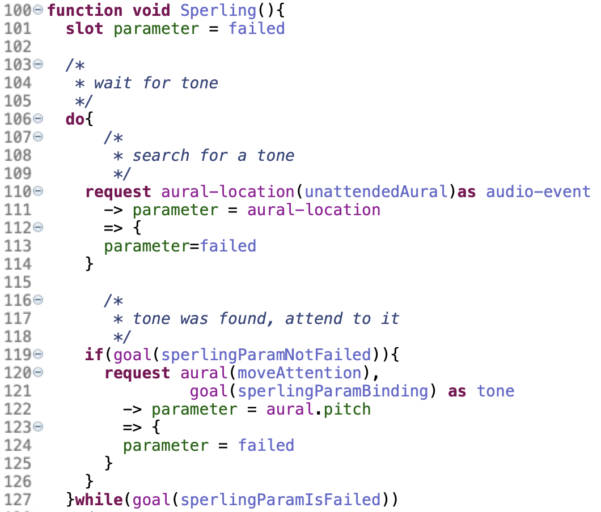
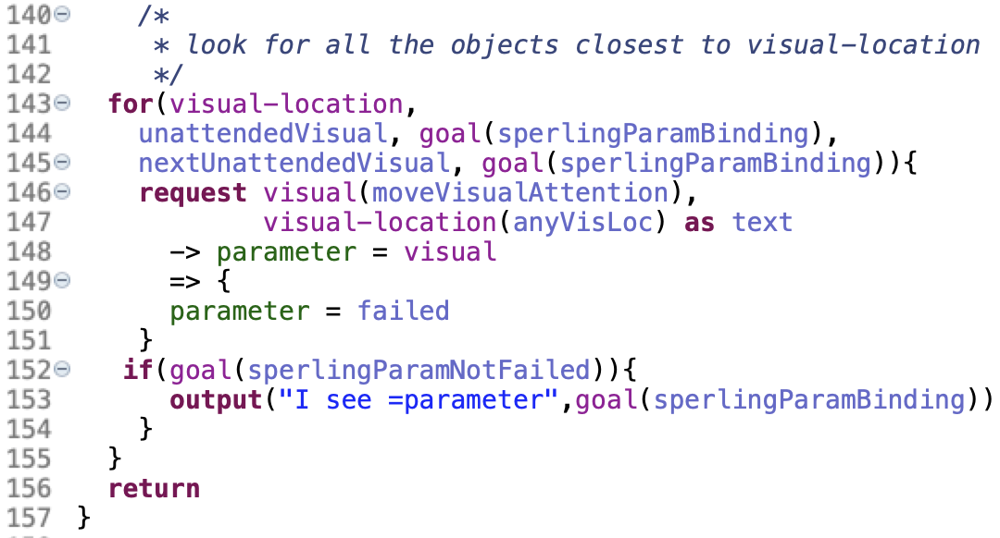

# Unit 1 Tutorial for JASM, Part 3

- [Sperling model](#sperling)
- [Running](#running) Sperling model

## Sperling
The Sperling model shows off the [Sperling](https://study.com/academy/lesson/iconic-memory-sperlings-partial-report-experiment.html) timed visual attention task. This JASM model highlights perception and introduces the **for** loop. 

Let's open *unit1/src/unit1/sperlingDefinition.jasm*. 

The first thing we do is we listen for a tone. This is wrapped in a **do-while** loop, conditioned on
*parameterIsFailed*. This is accomplished by **request**ing something from the *aural-location* buffer. If there is an *audio-event* available, we go on to shift attention to it by making a **request** of *aural*, keyed on the contents of *aural-location*.

Having heard a tone, we extract the pitch and make a *retrieval* **request** for an *Association* that links the pitch to the *visual-location* we should be attending to.

With the relevant *visual-location* we can then attend to everything in that row by using the **for** loop. The **for** loop takes an initial pattern and subsequent pattern including their binding patterns. The **for** loop runs until it reaches an error with its internal requests. This example merely attends to everything in a row, outputing each thing it sees along the way.

## Running
In addition to the *unit1/models/unit1/sperlingRunner.jactr* runner, you should be aware of *unit1/src/unit1/sperling/sensorData.xml* which contains the perceptual information injected into the model by another process (*XMLSensor* in the run configuration). 